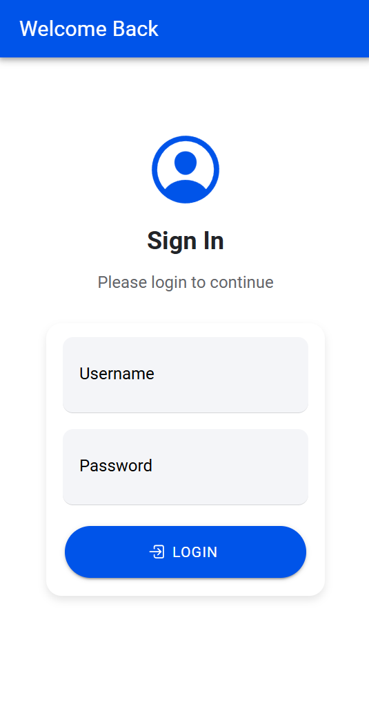
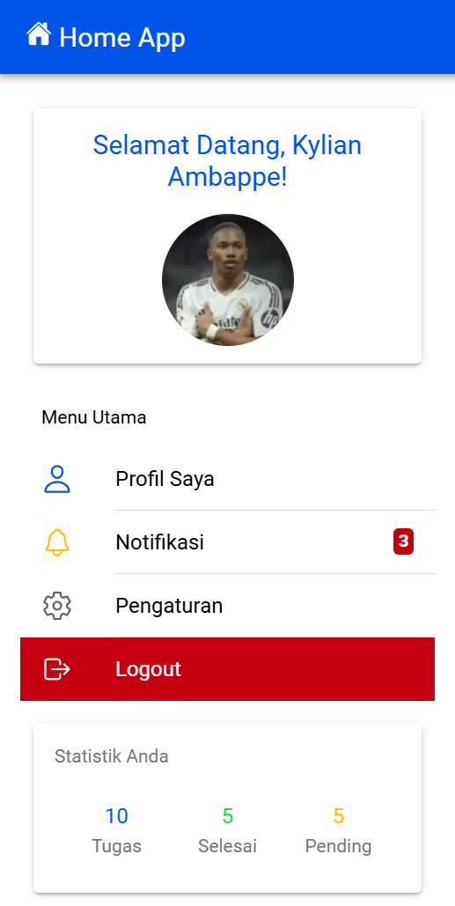

# Screnshoot Hasil 

# PENJELASAN CARA KERJA LOGIN PADA APLIKASI

## 1. Persiapan Komponen dan Service
Pertama-tama kita perlu menyiapkan komponen dan service yang diperlukan untuk proses login:
- Import modul Angular yang dibutuhkan (`Component`, `OnInit`)
- Import service autentikasi (`AuthenticationService`)
- Import Router untuk navigasi (`Router`)
- Deklarasi variabel untuk menyimpan username dan password

## 2. Implementasi Halaman Login
Pada halaman login (`LoginPage`) kita memiliki beberapa komponen penting:
- Class `LoginPage` yang mengimplementasikan `OnInit`
- Constructor yang menyertakan service autentikasi dan router
- Variabel `username` dan `password` untuk menampung input user
- Method `login()` yang akan menangani proses autentikasi

## 3. Proses Login
Method `login()` memiliki beberapa tahapan proses:
1. **Validasi Input**
   - Memeriksa apakah username dan password tidak kosong (`null`)
   - Jika kosong, akan menampilkan notifikasi "Username atau Password Tidak Boleh Kosong"

2. **Pengiriman Data**
   - Membuat objek data yang berisi username dan password
   - Mengirim data ke endpoint 'login.php' menggunakan `authService.postMethod()`

3. **Penanganan Response**
   - Jika login berhasil (`status_login == "berhasil"`):
     * Menyimpan token dan username dengan `authService.saveData()`
     * Mengosongkan form login
     * Mengarahkan user ke halaman home
   - Jika login gagal:
     * Menampilkan notifikasi kesalahan username/password

4. **Penanganan Error**
   - Jika terjadi kesalahan koneksi:
     * Menampilkan notifikasi untuk memeriksa koneksi internet

## 4. Keamanan dan Validasi
Sistem login memiliki beberapa lapisan keamanan:
- Validasi input di sisi client
- Penggunaan token untuk autentikasi
- Penanganan error untuk berbagai skenario
- Penyimpanan kredensial yang aman

## 5. Integrasi dengan Backend
Proses login terintegrasi dengan backend melalui:
- Endpoint API 'login.php'
- Penggunaan service autentikasi untuk komunikasi
- Penanganan response dari server
- Penyimpanan data sesi (token dan username)

## 6. Flow Data
1. User memasukkan username dan password
2. Data dikirim ke backend melalui AuthenticationService
3. Backend memproses dan mengirim response
4. Aplikasi menangani response:
   - Success: Simpan token & redirect
   - Failed: Tampilkan pesan error
   - Error: Tampilkan notifikasi koneksi

## 7. State Management
- Token dan username disimpan untuk sesi
- Form dikosongkan setelah login berhasil
- Navigasi otomatis ke halaman home setelah login sukses
- Penanganan state error saat koneksi gagal
